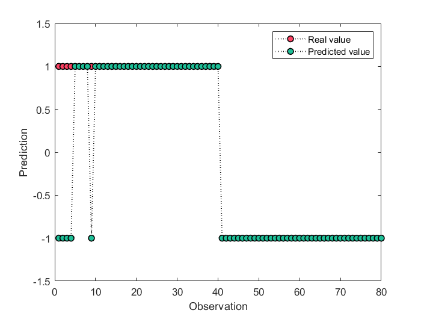

# libsvm-SVDD-WOA
 Using the WOA algorithm to optimize the parameters of SVDD algorithm in libsvm
 
## demo: heart_scale data

```
clc 
clear all
close all
addpath(genpath(pwd))

global traindata trainlabel

% heart_scale data
[traindata, testdata, trainlabel, testlabel] = prepareData;


% Parameter setting of WOA
agent = 10;            % Number of search agents
iteration = 20;        % Maximum numbef of iterations
lb = [10^-3,2^-4];     % Lower bound of 'c' and 'g'
ub = [10^0,2^4];       % Upper bound of 'c' and 'g'
dim = 2;               % Number of Parameter
fobj = @woa_obj;       % Objective function

% Parameter optimization using WOA
[Best_score, Best_pos,~] = WOA(agent, iteration, lb, ub, dim, fobj);


% Train SVDD hypersphere using the optimal parameters
cmd = ['-s 5 -t 2 ', '-c ', num2str(Best_pos(1,1)), ' -g ', ...
    num2str(Best_pos(1,2)), ' -q'];
model = libsvmtrain(trainlabel, traindata, cmd);

% Test 
[predictlabel, accuracy, ~] = libsvmpredict(testlabel, testdata, model);
```

### results
```
Accuracy = 13.3333% (16/120) (classification)
Accuracy = 93.3333% (112/120) (classification)
Accuracy = 13.3333% (16/120) (classification)
Accuracy = 73.3333% (88/120) (classification)
Accuracy = 33.3333% (40/120) (classification)
Accuracy = 13.3333% (16/120) (classification)
Accuracy = 93.3333% (112/120) (classification)
Accuracy = 20% (24/120) (classification)
Accuracy = 60% (72/120) (classification)
Accuracy = 13.3333% (16/120) (classification)

ans =

   20.0000    0.0667

Accuracy = 100% (150/150) (classification)
```

## demo: Industrial process data

```
clc 
clear all
addpath(genpath(pwd))

global traindata trainlabel

% Industrial process data
load ('.\data\data_2.mat')

% Parameter setting of WOA
agent = 10;            % Number of search agents
iteration = 30;        % Maximum numbef of iterations
lb = [10^-3,2^-7];     % Lower bound of 'c' and 'g'
ub = [10^0,2^7];       % Upper bound of 'c' and 'g'
dim = 2;               % Number of Parameter
fobj = @woa_obj;       % Objective function

% Parameter optimization using WOA
[Best_score, Best_pos, ~] = WOA(agent, iteration, lb, ub, dim, fobj);


% Train SVDD hypersphere using the optimal parameters
cmd = ['-s 5 -t 2 ', '-c ', num2str(Best_pos(1,1)), ' -g ', ...
    num2str(Best_pos(1,2)), ' -q'];
model = libsvmtrain(trainlabel, traindata, cmd);

% Test 
[predictlabel, accuracy, ~] = libsvmpredict(testlabel, testdata, model);

% Visualize the results
plotResult(testlabel,predictlabel)
```

### results
```
Accuracy = 99.5% (398/400) (classification)
Accuracy = 99.25% (397/400) (classification)
Accuracy = 99% (396/400) (classification)
Accuracy = 99% (396/400) (classification)
Accuracy = 99% (396/400) (classification)
Accuracy = 99.5% (398/400) (classification)
Accuracy = 99.75% (399/400) (classification)
Accuracy = 99.5% (398/400) (classification)
Accuracy = 99% (396/400) (classification)
Accuracy = 99% (396/400) (classification)

ans =

   30.0000    0.0025

Accuracy = 93.75% (75/80) (classification)
```

